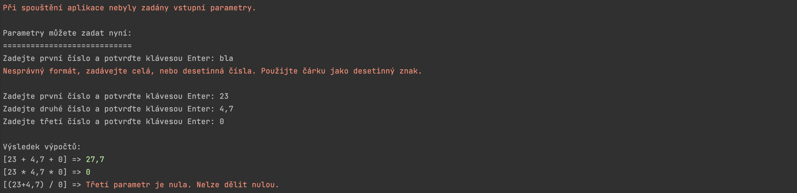

# Simple console calculator app

The application can start with or without three input arguments. In the first case, the application validates the arguments and calculates the output, or tells the user if the input data were invalid and why.

In case of no input arguments on startup, the application asks for the input during the runtime.

> **Calculations**  
n1 + n2 + n3  
n1 * n2 * n3  
(n1 + n2) / n3

### Run from CLI

> dotnet build --output ./build_output  
dotnet ./build_output/my_app.dll n1 n2 n3  

More on that: https://learn.microsoft.com/en-us/dotnet/core/tools/?tabs=netcore2x
